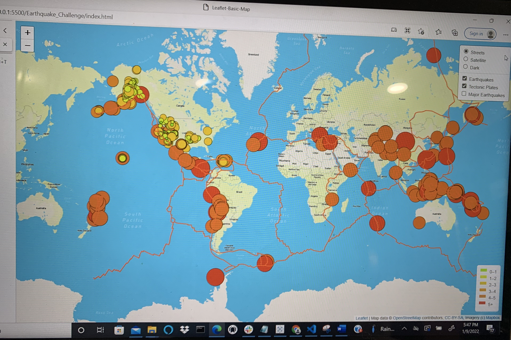
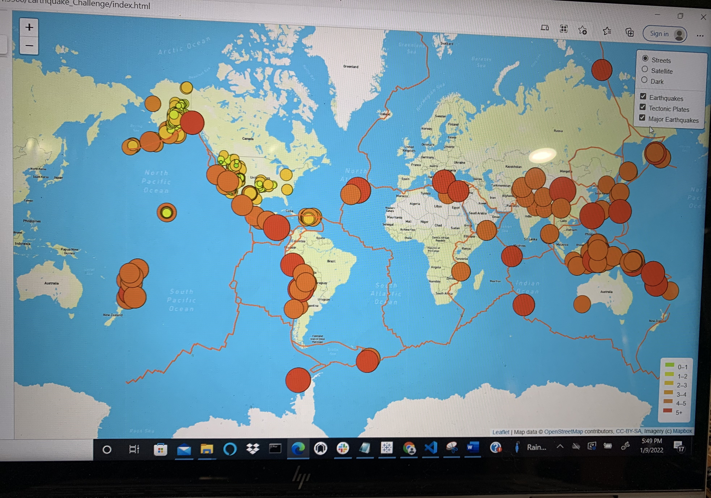
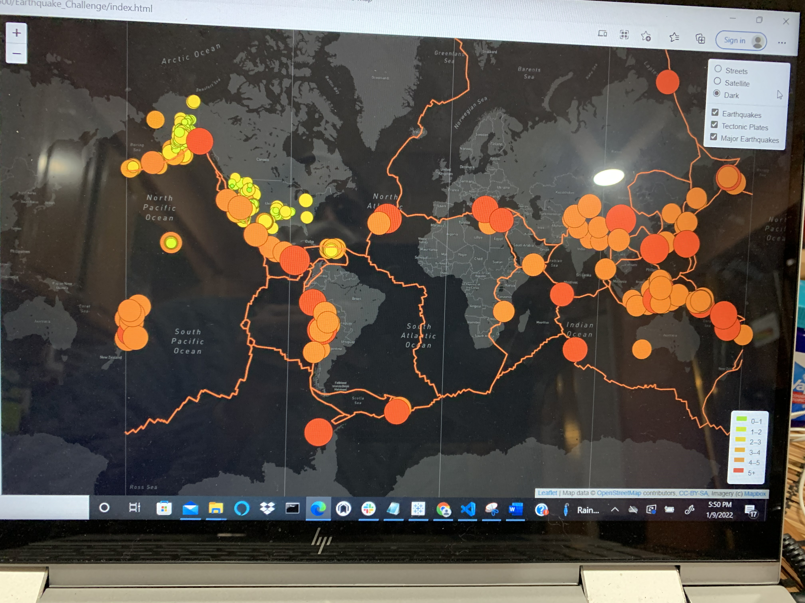

# Mapping_Earthquakes
Mapping Earthquakes

Enhancements are needed to make additions of earthquake data in relation to the tectonic plates’ location on the earth, and also to add earthquakes with a magnitude greater than 4.5 on the map. An additional map is needed which would be the third map.

## Deliverable 1
  ### Add Tectonic Plate Data
  

## Deliverable 2
  ### Add Major Earthquake Data
  

## Deliverable 3
 ### Add an Additional Map

